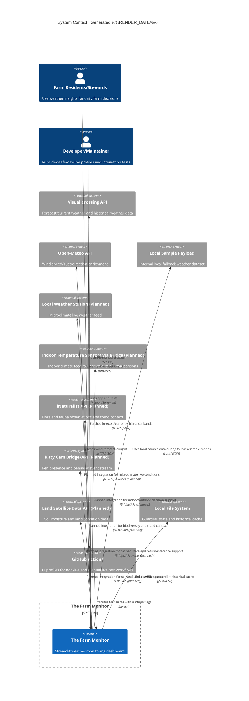

# C1 - System Context

## Purpose

Show The Farm Monitor as a system and its relationships with users and external systems.

## Context Narrative

- Primary actors are farm residents and stewards using the dashboard for human-reviewed daily decisions.
- Current live providers are Visual Crossing (primary weather + historical band) and Open-Meteo (wind enrichment/override).
- Local sample payloads and local filesystem state are significant context dependencies for fallback reliability.
- Planned context integrations include local weather station feeds, indoor sensors via bridge, iNaturalist, kitty camera events, and land satellite data.
- CI is part of the system context due to enforced runtime profile behavior and live/non-live test separation.

## Key Constraints

- API usage is constrained by development guardrails (budget + cooldown).
- Non-live test workflows must not hit external network APIs.
- Production profile must remain live-data capable.
