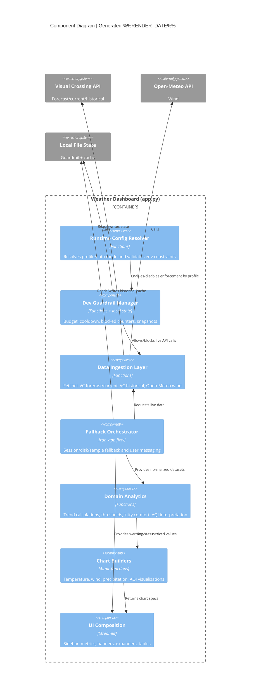

# C3 - Component Diagram

## Purpose

Show major components inside the main weather container.

## Weather Dashboard Components

### Weather Component Responsibilities

- Runtime Config Resolver:
  - Determines profile (`prod`, `dev-safe`, `dev-live`, `ci-non-live`, `ci-live-manual`).
  - Raises validation errors for invalid combinations.
- Dev Guardrail Manager:
  - Enforces per-provider budgets in dev-live.
  - Applies cooldown after 429 and records blocked attempts.
- Data Ingestion Layer:
  - Retrieves forecast/current weather and historical aggregation inputs.
  - Retrieves Open-Meteo wind for replacement merge.
- Fallback Orchestrator:
  - Implements cascading fallback strategy (live -> cache/session -> sample).
- Domain Analytics:
  - Threshold evaluations, trend deltas, comfort status, AQI labels.
- Chart Builders:
  - Encodes observed/forecast bridges and historical overlays.
- UI Composition:
  - Renders final user-visible dashboard state.
