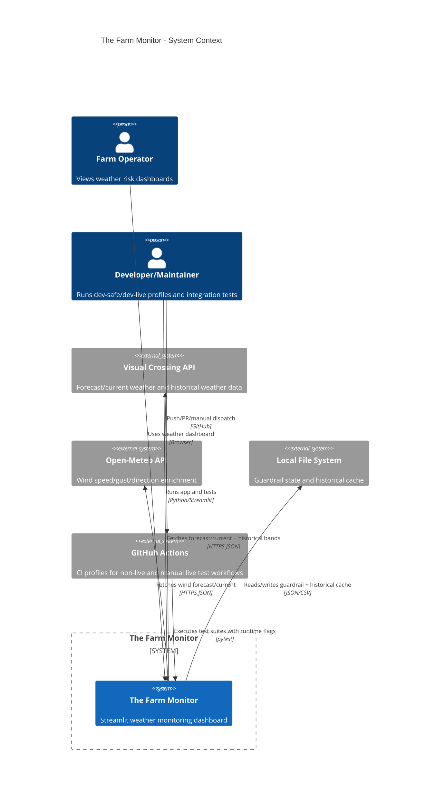

# C1 - System Context

## Purpose

Show The Farm Monitor as a system and its relationships with users and external systems.

## Context Narrative

- Primary actor is the farm operator who consumes operational weather insights.
- The application integrates two weather providers:
  - Visual Crossing for primary weather and historical band.
  - Open-Meteo for wind override.
- Local filesystem is architecturally significant because fallback reliability depends on persisted state.
- CI is part of the system context due to enforced runtime profile behavior and live/non-live test separation.

## Key Constraints

- API usage is constrained by development guardrails (budget + cooldown).
- Non-live test workflows must not hit external network APIs.
- Production profile must remain live-data capable.
