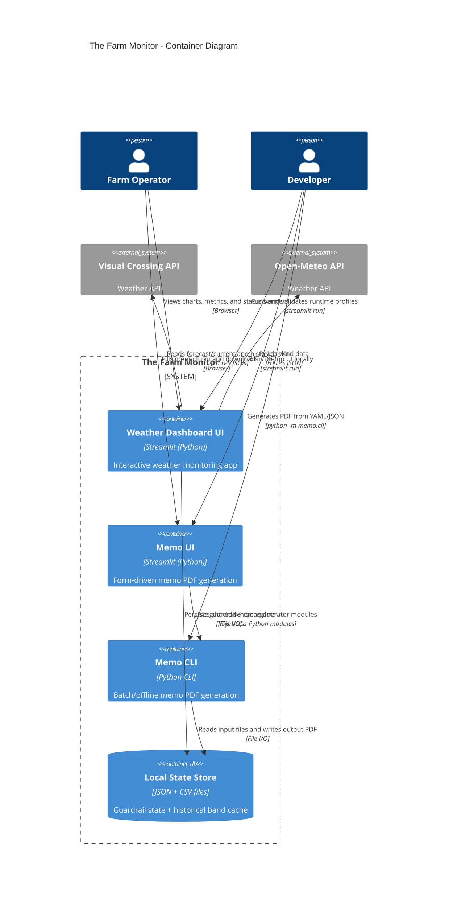

# C2 - Container Diagram

## Purpose

Show deployable/runtime containers and data flow between them.

## Container Narrative

- `Weather Dashboard UI` is the core operational container and includes guardrails, fallback logic, and visual analytics.
- `Memo UI` and `Memo CLI` are separate entry points sharing the same domain and PDF generation internals.
- `Local State Store` is not a service but is modeled as a container DB because it stores stateful artifacts:
  - `.streamlit/guardrails/dev_api_state.json`
  - `.streamlit/hist_cache/hist_YYYY-MM-DD.csv`

## Reliability and Operation Notes

- Weather container degrades to cached/session/sample data on provider failures.
- Memo containers are deterministic and do not require external APIs.
- Runtime profile configuration determines whether external API calls are allowed.
