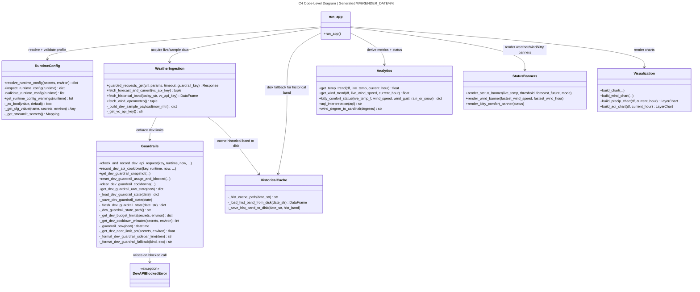

# C4 - Code-Level Diagram

## Purpose

Provide a complete code-level view of all public and internal components in `app.py`.

## Runtime + Guardrail + Weather Fetch Flow

### Code-Level Notes

- `DevAPIBlockedError` is a custom exception raised by guardrails when a live API call is blocked (budget exhausted, cooldown active).
- `guarded_requests_get` centralizes guardrail enforcement for all live HTTP calls and records 429 cooldowns.
- `fetch_historical_band` includes leap-day handling, 429 early-stop, and 7-day `@st.cache_data` TTL.
- `HistoricalCache` manages the disk-based CSV cache for historical band data, providing fallback when live fetch is unavailable.
- `_format_dev_guardrail_fallback` generates user-facing messages that distinguish budget exhaustion, cooldown, and general outage.
- `run_app` coordinates fallback order (live → session → disk cache → sample), then passes normalized datasets to analytics, banners, and chart builders.
- `RuntimeConfig` includes `inspect_runtime_config` which returns both errors and warnings in a single call, used internally by the convenience wrappers.

## Traceability To Requirements

Primary requirement trace file: [../feature-requirements.md](../feature-requirements.md)

Mapping guidance:
- Runtime profile and guardrail requirements map to `RuntimeConfig` and `Guardrails`.
- Weather fallback and cache behavior map to `run_app`, `WeatherIngestion`, and `HistoricalCache`.
- Analytics and threshold logic map to `Analytics` and `StatusBanners`.
- Chart rendering maps to `Visualization`.
