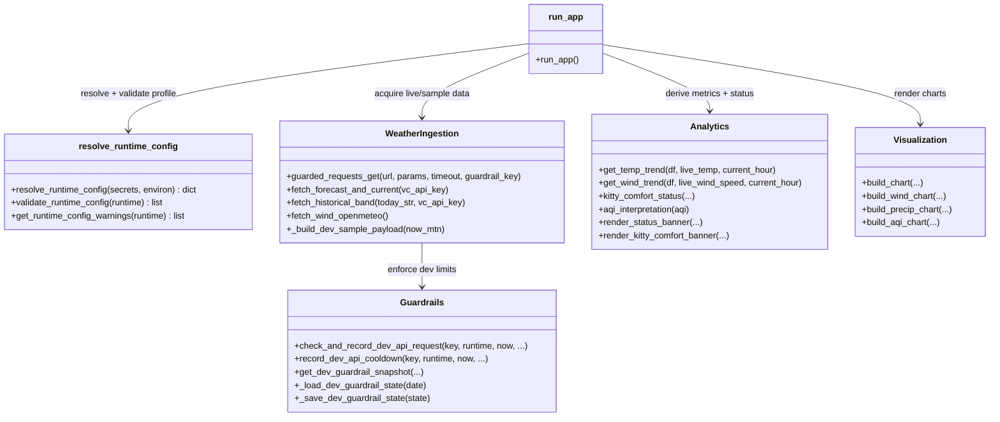
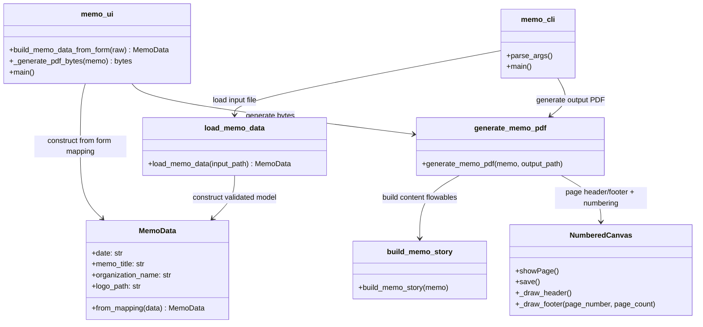

# C4 - Code-Level Diagram

## Purpose

Provide code-level views for implementation-critical components.

## C4A - Runtime + Guardrail + Weather Fetch Flow

### Code-Level Notes (Weather)

- `guarded_requests_get` centralizes guardrail enforcement for all live HTTP calls.
- `fetch_historical_band` includes leap-day handling and 429 early-stop behavior.
- `run_app` coordinates fallback order, then passes normalized datasets to analytics + chart builders.

## C4B - Memo Data-to-PDF Flow

### Code-Level Notes (Memo)

- `MemoData.from_mapping` is the contract gate for required fields and date format.
- `NumberedCanvas` performs post-page buffering so footer can render `Page X of Y` accurately.
- UI and CLI share the same schema + generator path, reducing behavior drift.

## Traceability To Requirements

Primary requirement trace file: [../feature-requirements.md](../feature-requirements.md)

Mapping guidance:
- Runtime profile and guardrail requirements map to C4A classes `resolve_runtime_config` and `Guardrails`.
- Weather fallback and chart behavior map to `run_app`, `WeatherIngestion`, `Analytics`, and `Visualization`.
- Memo requirements map to C4B classes `MemoData`, `generate_memo_pdf`, `memo_ui`, and `memo_cli`.
