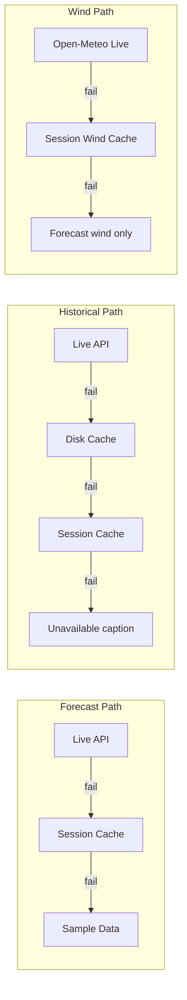

# C4 Supplementary: UI Feature → Backend Map

## Purpose

Show how each user-visible UI section connects to backend data sources, analytics, and fallback paths.

## UI Feature Map

```mermaid
graph TB
    subgraph UI["Dashboard UI (Streamlit)"]
        sidebar["Sidebar Settings"]
        temp_metrics["Temperature Metrics<br/>Now / High / Low / Trend"]
        status_banner["Seasonal Status Banner<br/>Warming / Cooling Focus"]
        kitty_banner["Kitty Comfort Banner<br/>Temp + Wind + Precip checks"]
        temp_chart["Temperature Chart<br/>Forecast + Observed + Historical Band"]
        wind_section["Wind Section<br/>Speed / Direction / Gust / Fastest"]
        wind_chart["Wind Chart<br/>Actual vs Forecast + Gust + Historical"]
        precip_section["Precipitation Section<br/>Rain/Snow / Accumulation / Probability"]
        precip_chart["Precipitation Chart<br/>Hourly Actual"]
        aqi_section["AQI Section<br/>Current / High / Low + Category"]
        aqi_chart["AQI Chart<br/>Observed vs Forecast"]
        pollutant_table["Pollutant Table<br/>PM2.5 / PM10 / O3 / NO2 / SO2 / CO"]
        data_sources["Data Sources Panel<br/>Provider attribution + caveats"]
        guardrail_controls["Guardrail Controls (Dev)<br/>Reset / Clear / Raw State"]
    end

    subgraph Backend["Backend Components"]
        runtime["RuntimeConfig<br/>resolve_runtime_config()"]
        guardrails["Guardrails<br/>check_and_record_dev_api_request()"]
        vc_fetch["WeatherIngestion<br/>fetch_forecast_and_current()"]
        hist_fetch["WeatherIngestion<br/>fetch_historical_band()"]
        wind_fetch["WeatherIngestion<br/>fetch_wind_openmeteo()"]
        sample["WeatherIngestion<br/>_build_dev_sample_payload()"]
        analytics["Analytics<br/>get_temp_trend() / get_wind_trend()"]
        comfort["Analytics<br/>kitty_comfort_status()"]
        aqi_interp["Analytics<br/>aqi_interpretation()"]
        banners["StatusBanners<br/>render_status_banner() / render_wind_banner()"]
        viz["Visualization<br/>build_chart() / build_wind_chart()"]
        hist_cache["HistoricalCache<br/>_load_hist_band_from_disk()"]
    end

    subgraph External["External Systems"]
        vc_api["Visual Crossing API"]
        om_api["Open-Meteo API"]
        local_state["Local File State<br/>guardrails JSON + hist CSV"]
    end

    %% Sidebar
    sidebar -->|"mode + threshold"| status_banner
    sidebar -->|"Feels Like / Actual"| temp_metrics
    sidebar -->|"profile display"| runtime
    guardrail_controls -->|"reset / clear"| guardrails

    %% Temperature flow
    vc_fetch --> temp_metrics
    analytics --> temp_metrics
    vc_fetch --> status_banner
    banners --> status_banner
    vc_fetch --> temp_chart
    hist_fetch --> temp_chart
    viz --> temp_chart

    %% Kitty comfort
    vc_fetch --> kitty_banner
    wind_fetch --> kitty_banner
    comfort --> kitty_banner

    %% Wind flow
    wind_fetch --> wind_section
    analytics --> wind_section
    wind_fetch --> wind_chart
    vc_fetch --> wind_chart
    hist_fetch --> wind_chart
    viz --> wind_chart

    %% Precipitation flow
    vc_fetch --> precip_section
    vc_fetch --> precip_chart
    viz --> precip_chart

    %% AQI flow
    vc_fetch --> aqi_section
    aqi_interp --> aqi_section
    vc_fetch --> aqi_chart
    viz --> aqi_chart
    vc_fetch --> pollutant_table

    %% External dependencies
    vc_fetch -->|"HTTPS"| vc_api
    hist_fetch -->|"HTTPS"| vc_api
    wind_fetch -->|"HTTPS"| om_api
    guardrails -->|"read/write"| local_state
    hist_cache -->|"read/write"| local_state

    %% Guardrail enforcement
    runtime --> guardrails
    guardrails -->|"allow/block"| vc_fetch
    guardrails -->|"allow/block"| hist_fetch
    guardrails -->|"allow/block"| wind_fetch
    runtime -->|"force sample"| sample

    %% Fallback paths
    hist_cache -.->|"disk fallback"| hist_fetch
    sample -.->|"emergency fallback"| vc_fetch
```

## Feature → Data Source Matrix

| UI Feature | Visual Crossing | Open-Meteo | Historical Cache | Session State | Sample Data |
|---|---|---|---|---|---|
| Temperature Metrics | Primary | — | — | Fallback | Emergency |
| Seasonal Status Banner | Primary | — | — | Fallback | Emergency |
| Kitty Comfort | Primary | Wind data | — | Fallback | Emergency |
| Temperature Chart | Forecast lines | — | Historical band | Fallback | Emergency |
| Wind Section | Forecast wind | Live override | — | Fallback | Emergency |
| Wind Chart | Forecast wind | Live override | Historical band | Fallback | Emergency |
| Precipitation Section | Primary | — | — | Fallback | Emergency |
| Precipitation Chart | Primary | — | — | Fallback | Emergency |
| AQI Section | Primary | — | — | Fallback | Emergency |
| AQI Chart | Primary | — | — | Fallback | Emergency |
| Pollutant Table | Primary | — | — | Fallback | Emergency |
| Guardrail Controls | — | — | — | — | — |
| Data Sources Panel | Static | Static | — | — | — |

## Fallback Cascade

